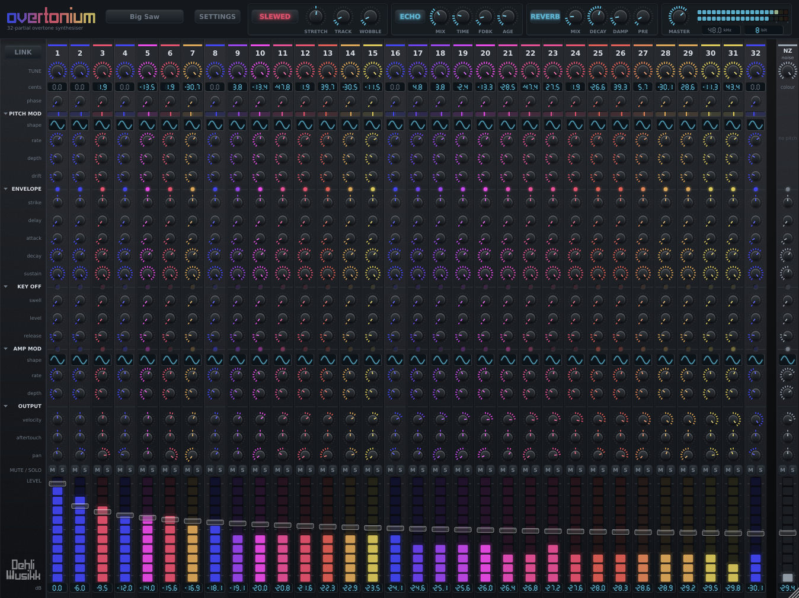
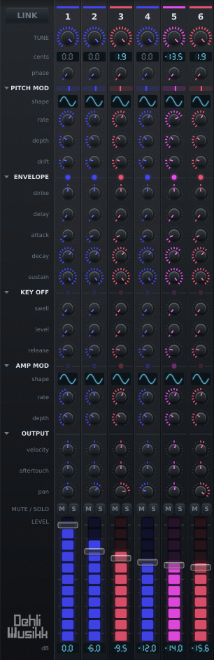

# Overtonium

A 32-partial additive synthesiser laid out like a 32-channel mixer. Every channel is one sine oscillator locked to a harmonic of the played note, and every channel has its own tuning, envelope and modulation.

The control worth reaching for first is TUNE. It sweeps each partial continuously between equal temperament and just intonation. At the just end the partial sits at an exact integer ratio with the fundamental and the whole stack fuses into a single timbre. At the equal end each partial snaps to the nearest 12-TET semitone and the same stack smears into a chord. The factory presets _Just Saw_ and _Equal Saw_ are identical except for that one control, and they sound nothing alike.



[](https://github.com/benjamindehli/overtonium/actions/workflows/build.yml)

- **Formats:** VST3, AU (macOS), Standalone, LV2 (Linux)
- **Platforms:** macOS (universal), Windows, Linux
- **Framework:** JUCE 8
- **Licence:** AGPLv3. See [Licensing](#licensing)
- **Page:** [benjamindehli.github.io/overtonium](https://benjamindehli.github.io/overtonium/), built from `docs/`
- **Listed at:** [KVR Audio](https://www.kvraudio.com/product/overtonium-by-dehli-musikk)
- **By:** Benjamin Dehli for Dehli Musikk. Hosts list it under DehliMusikk (manufacturer code `Dhmk`, plugin code `Ovtn`)
- **Also here:** [design notes](DESIGN.md), [contributing](CONTRIBUTING.md), [architecture](ARCHITECTURE.md), [security policy](SECURITY.md), [code of conduct](CODE_OF_CONDUCT.md)

CI builds all three platforms and runs the test suite on each of them on every push, and macOS is the only one where the plugin has been loaded into a host. The Audio Unit and the VST3 pass `auval` and pluginval at strictness 8 there. Nobody has yet run the Windows or Linux builds in a DAW, so treat those as untried and please report what you find.

## Background

This is the third instrument in a line, and the first that computes its sound rather than playing it back.

[Voltage Controlled Cassette Organ](https://github.com/benjamindehli/VoltageControlledCassetteOrgan) came first, in 2023. A Korg CX-3 sampled through cassette tape, every note of every drawbar recorded as its own file. The tape was the point: wow, flutter and random warbles gave the organ a movement like a chorus or a rotary speaker without the fixed rate a modulation effect has. It was recorded to tape twice, which doubled it, and since no tape deck plays back the same way twice the two passes never quite agreed.

[EDB-Orgel](https://github.com/benjamindehli/EDB-Orgel) followed in 2024, keeping the drawbar workflow and putting four digital synthesis types under it instead of an organ.

Both gave every drawbar its own envelope and LFO, which is the idea this one is built out of. A drawbar is a partial. Nine of them shaped separately already sounds unlike an organ, so thirty-two of them, each with a full channel of controls, is that idea taken as far as it goes. Computing them is also what makes TUNE possible: a sampled partial is stuck at the pitch it was recorded at, and a computed one can be swept between equal temperament and its exact integer ratio.

The ancestry is visible in the details rather than only in the shape. DRIFT is the cassette's random warble, one per partial. WOBBLE is the same thing under the whole instrument. The tape echo's two paths, each with its own motor speed and its own random stream, are the double tracking, and `TapeEcho::kMinAge` exists for the same reason the two tape passes never agreed: a transport that held speed exactly would put the repeat back in mono, and there is no such transport.

Both earlier instruments are sample libraries with a plugin wrapper, sold at [Dehli Musikk](https://store.dehlimusikk.no/). This one is free software, and none of their code is in it.

## What is in it

Every channel is a strip, and every strip carries the same twenty-one controls. The captions are named once down the left rather than repeated across all thirty-three, and each channel takes the colour of its interval against the fundamental.



The [project page](https://benjamindehli.github.io/overtonium/) is the place to start, and it has a page each for the parts worth reading about:

- **[Tuning](https://benjamindehli.github.io/overtonium/tuning/)**: TUNE from equal to just, inharmonic stretch, six historical temperaments on any root, keyboard tracking and per-partial drift
- **[Controls](https://benjamindehli.github.io/overtonium/controls/)**: every knob on a channel strip and on the bar above it, the two-part envelope, LINK for ganging the series, the lamps and meters, the noise channel and MPE
- **[Presets](https://benjamindehli.github.io/overtonium/presets/)**: the nineteen that ship, what a preset carries and deliberately does not, and where your own are kept
- **[Install](https://benjamindehli.github.io/overtonium/install/)**: which download to take, what to do when a host cannot see the plugin, and building from source

[DESIGN.md](DESIGN.md) is the same ground at length, and keeps the reasoning: what each part does, what the alternatives cost, and the measurements behind the numbers.

## Building and contributing

You need CMake 3.22 or newer and a C++17 compiler. JUCE is downloaded at configure time.

```sh
cmake -B build -DCMAKE_BUILD_TYPE=Release
cmake --build build
```

[CONTRIBUTING.md](CONTRIBUTING.md) has the rest: per-platform notes, the two test suites, formatting, warnings as errors, how a release is cut and how the project page is served. [ARCHITECTURE.md](ARCHITECTURE.md) describes how the code is arranged.

## Checking for updates

Off unless asked for. The first time an editor opens, the credit line under the wordmark offers to turn the check on, once, and nothing reaches the network unless that offer is taken. Ignoring it costs nothing and it is not asked again. The setting lives under Settings from then on.

With it on, a background thread fetches `docs/latest.json` from the project page and compares the version in it against this build. If the file names something newer, the credit line says so and clicking it opens the release page. It is a plain GET for one small static file: no identifier, no version, nothing about the machine, and the server it reaches is the same one serving the documentation.

The preference is kept in a settings file beside the presets rather than in the plugin's state. It belongs to the person rather than to a patch, and kept in the state it would be asked afresh by every new instance, which is what a host walking its plugin folder makes dozens of.

There is deliberately no dialog. A plugin cannot tell someone opening it from a host scanning at startup, and a modal in the second case stops the scan.

The release workflow rewrites `docs/latest.json` as part of publishing, so the feed cannot name a version that was never shipped, and cannot lag one that was.

## Licensing

Overtonium is released under the [AGPLv3](LICENSE).

That follows from what it is built on. The JUCE 8 framework modules are dual-licensed under the AGPLv3 or a paid commercial licence, and a plugin is a single combined work with them, so the combination has to be conveyed under terms the AGPL allows. Taking the AGPL for this project too is the simplest way to be exactly what it says it is. The network clause the AGPL is known for, section 13, only applies to software users interact with remotely over a network, which an audio plugin is not, so in practice it reads as the GPL does.

If you want to build on this and ship something closed-source, that needs a commercial JUCE licence from the JUCE side and a separate arrangement on this side, since the AGPL does not permit it.

There is no splash screen to worry about. JUCE 6 and 7 had one, and disabling it was the thing that required a paid licence. JUCE 8 removed it, and `JUCE_DISPLAY_SPLASH_SCREEN` is now ignored with a compiler warning if you define it.
